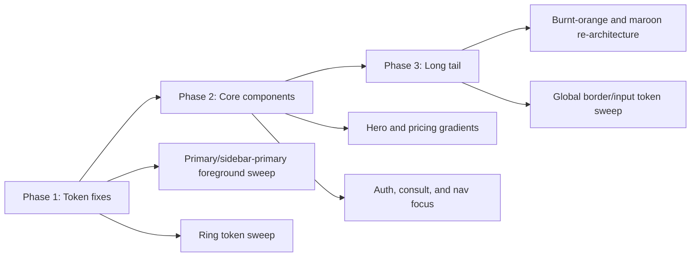

# Color Contrast And Focus Audit

## Executive Summary

AA baseline status: partially met after remediation. I audited the public landing flow, auth flow, high-traffic marketing components, and theme token variants using WCAG 2.1/2.2 contrast math with alpha compositing. Seventeen findings are already patched in the current working tree. The original sampled audit still has three open AA risks: \`theme-burnt-orange\`, \`theme-maroon\`, and the low-contrast global \`--border\` / \`--input\` token family.

Full theme coverage is now documented in \`docs/accessibility/theme-contrast-matrix.md\` and \`docs/accessibility/theme-contrast-matrix.json\`. That full token sweep covers every declared theme scope in \`base.css\` and \`variants.css\`, and it adds one contextual AA risk outside the original 20-finding sample: \`.theme-forest\` falls to 3.62:1 when \`--foreground\` is reused on \`--card\` instead of \`--card-foreground\`.

Top technical risks were light marketing gradients using white text, custom focus indicators that were too faint for WCAG 2.2 section 2.4.13, and alternate themes whose primary/ring tokens drifted below AA thresholds. ADA Title III relevance: these are technical accessibility findings about perceivable and operable UI barriers on customer-facing UI, not legal advice.

## Scope

- Pages/components in scope: \`/\`, \`/auth\`, \`HeroSection\`, \`CreativePricing\`, \`ConsultForm\`, \`AdaptiveNavPill\`, auth inputs, theme token variants.
- Theme token coverage: \`:root\`, \`.dark\`, \`.theme-light\`, \`.theme-dark\`, \`.theme-midnight\`, \`.theme-dream\`, \`.theme-forest\`, \`.theme-gilded\`, \`.theme-rose\`, \`.theme-autumn\`, \`.theme-honey\`, \`.theme-burnt-orange\`, \`.theme-maroon\`.
- Breakpoints: mobile-first source review plus desktop token sweep.
- Target: AA baseline with AAA delta notes.
- Sampling strategy: WCAG-EM-style targeted sample of critical public flows, highest-traffic components, and highest-risk alternate themes.
- Manual review still recommended for: text on images, non-solid chart strokes, decorative mock controls that remain focusable, SVG/canvas visuals, and components whose visible boundary relies more on shadows than borders.

## Findings

| page/component | element selector | state | text-size class | fg color | bg color | computed contrast ratio | WCAG pass/fail (AA/AAA + SC id) | recommended fix (exact hex + delta) | remediation difficulty | CSS/patch snippet |
| --- | --- | --- | --- | --- | --- | --- | --- | --- | --- | --- |
| / - Hero CTA (patched) | `#hero [data-analytics-id="hero_cta_click"]` | default | normal | `#ffffff` | `#5dd6f7` | 1.69:1 | Fail AA 1.4.3; Fail AAA 1.4.6 | `#ffffff -> #0f172a` (foreground only; est. 8.45:1) | S | `text-white -> text-slate-900` |
| / - Hero logotype (patched) | `#hero h1 > span.block` | default | large | `#ffd27f` | `#ffffff` | 1.48:1 | Fail AA 1.4.3; Fail AAA 1.4.6 | `#ff9776/#ffd27f/#7dd3fc/#2f80ed -> #c2410c/#b45309/#0f4c81/#1d4ed8` (est. 5.02:1) | S | `bg-[linear-gradient(100deg,_#c2410c_0%,_#b45309_38%,_#0f4c81_68%,_#1d4ed8_100%)]` |
| / - Auth placeholders (patched) | `input#email::placeholder, input#password::placeholder` | default | normal | `#94a3b8` | `#ffffff` | 2.54:1 | Fail AA 1.4.3; Fail AAA 1.4.6 | `#94a3b8 -> #64748b` (est. 4.76:1) | S | `placeholder:text-slate-400 -> placeholder:text-slate-500` |
| /auth - Auth input focus (patched) | `input#email, input#password` | focus-visible | n/a | `rgba(255,151,118,0.30)` | `#ffffff` | 1.25:1 | Pass AA 2.4.7 / 2.4.11; Fail AAA 2.4.13 | `rgba(255,151,118,0.30) -> #2563eb` (est. 5.17:1) | S | `focus-visible:outline focus-visible:outline-2 focus-visible:outline-[color:var(--ring)]` |
| / - Consult placeholders (patched) | `#custom-email::placeholder, #custom-team::placeholder, #custom-notes::placeholder` | default | normal | `rgba(255,255,255,0.40)` | `rgba(0,0,0,0.40) over #050816` | 3.71:1 | Fail AA 1.4.3; Fail AAA 1.4.6 | `rgba(255,255,255,0.40) -> rgba(255,255,255,0.50)` (est. 5.30:1) | S | `placeholder:text-white/40 -> placeholder:text-white/50` |
| / - Consult field boundary (patched) | `#custom-email, #custom-team, #custom-notes` | default | n/a | `rgba(255,255,255,0.15)` | `rgba(0,0,0,0.40) over #050816` | 1.49:1 | Fail AA 1.4.11 | `rgba(255,255,255,0.15) -> rgba(255,255,255,0.35)` (est. 3.18:1) | S | `border-white/15 -> border-white/35` |
| / - Consult focus (patched) | `#custom-email, #custom-team, #custom-notes` | focus-visible | n/a | `rgba(255,151,118,0.40)` | `rgba(0,0,0,0.40) over #050816` | 2.36:1 | Pass AA 2.4.7 / 2.4.11; Fail AAA 2.4.13 | `rgba(255,151,118,0.40) -> #ffffff` (est. 11.72:1) | S | `focus-visible:outline focus-visible:outline-2 focus-visible:outline-white` |
| / - Adaptive nav focus (patched) | `button[role="tab"]` | focus-visible | n/a | `#febf9b` | `#ffffff` | 1.72:1 | Pass AA 2.4.7 / 2.4.11; Fail AAA 2.4.13 | `#febf9b -> #0f4c81` (est. 8.86:1) | S | `focus-visible:outline-[#febf9b] -> focus-visible:outline-[#0f4c81]` |
| / - Creative pricing warm accents (patched) | `.popular badge, .popular CTA, .tier icon` | default | normal | `#ffffff` | `#fdba74` | 1.69:1 | Fail AA 1.4.3; Fail AAA 1.4.6 | `#ffffff -> #0f172a` (est. 6.37:1) | S | `text-white -> text-[#0f172a]` |
| / - Creative pricing business surfaces (patched) | `.popular business badge, .popular business CTA` | default | normal | `#ffffff` | `#60a5fa` | 2.54:1 | Fail AA 1.4.3; Fail AAA 1.4.6 | `#2563eb -> #1d4ed8/#2563eb gradient sweep` (est. 5.17:1 with white text) | S | `from-[#2563eb] to-[#60a5fa] -> from-[#1d4ed8] to-[#2563eb]` |
| theme-dark + .dark - Primary/sidebar-primary tokens (patched) | `.dark, .theme-dark` | default | normal | `#ffffff` | `#63a8ff` | 2.45:1 | Fail AA 1.4.3; Fail AAA 1.4.6 | `#ffffff -> #0f172a` (est. 7.29:1) | S | `--primary-foreground: #0f172a; --sidebar-primary-foreground: #0f172a;` |
| theme-midnight - Primary/sidebar-primary tokens (patched) | `.theme-midnight` | default | normal | `#ffffff` | `#8d5fff` | 4.03:1 | Fail AA 1.4.3; Fail AAA 1.4.6 | `#ffffff -> #050816` (est. 4.95:1) | S | `--primary-foreground: #050816; --sidebar-primary-foreground: #050816;` |
| theme-gilded - Primary/sidebar-primary tokens (patched) | `.theme-gilded` | default | normal | `#ffffff` | `#b16c04` | 4.19:1 | Fail AA 1.4.3; Fail AAA 1.4.6 | `#ffffff -> #050816` (est. 4.76:1) | S | `--primary-foreground: #050816; --sidebar-primary-foreground: #050816;` |
| theme-rose - Primary/sidebar-primary tokens (patched) | `.theme-rose` | default | normal | `#fff4ec` | `#df4d3a` | 3.69:1 | Fail AA 1.4.3; Fail AAA 1.4.6 | `#fff4ec -> #050816` (est. 5.00:1) | S | `--primary-foreground: #050816; --sidebar-primary-foreground: #050816;` |
| theme-forest - Card/secondary text tokens (patched) | `.theme-forest` | default | normal | `#c0ae9a` | `#4a5d4f` | 3.29:1 | Fail AA 1.4.3; Fail AAA 1.4.6 | `#c0ae9a -> #f7f0e2` (est. 6.24:1) | M | `--card-foreground: #f7f0e2; --secondary-foreground: #f7f0e2; --muted-foreground: #f7f0e2;` |
| theme-forest - Focus ring token (patched) | `.theme-forest` | focus-visible | n/a | `#a45b3e` | `#273529` | 2.55:1 | Fail AA 1.4.11; Fail AAA 2.4.13 | `#a45b3e -> #c79c7e` (est. 5.21:1) | S | `--ring: #c79c7e; --sidebar-ring: #c79c7e;` |
| theme-rose/theme-autumn/theme-honey - Warm-theme ring sweep (patched) | `.theme-rose, .theme-autumn, .theme-honey` | focus-visible | n/a | `#ec6a43` | `#ffe0d2` | 2.51:1 | Fail AA 1.4.11; Fail AAA 2.4.13 | `#ec6a43/#cb6539/#df6206 -> #9a3412` (est. min 5.35:1) | S | `--ring: #9a3412; --sidebar-ring: #9a3412;` |
| theme-burnt-orange - Global foreground/focus tokens (open) | `.theme-burnt-orange` | default / focus-visible | normal | `#7a3a00` | `#c05600` | 1.88:1 | Fail AA 1.4.3; ring-on-card also fails AA 1.4.11 at 1.07:1 | Introduce page/card/focus surface tokens instead of one shared foreground/ring value | L | `--page-foreground`, `--card-foreground`, `--focus-ring-inner`, `--focus-ring-outer` |
| theme-maroon - Global foreground/focus tokens (open) | `.theme-maroon` | default / focus-visible | normal | `#500000` | `#500000` | 1.00:1 | Fail AA 1.4.3; ring also fails AA 1.4.11 at 1.00:1 | Introduce page/card/focus surface tokens instead of one shared foreground/ring value | L | `--page-foreground`, `--card-foreground`, `--focus-ring-inner`, `--focus-ring-outer` |
| design-system sweep - Border/input boundary tokens (open) | `:root, .theme-light, .theme-dark, .theme-dream, .theme-honey` | default | n/a | `#d7deed` | `#ffffff` | 1.35:1 | Fail AA 1.4.11 | Darken `--border` / `--input` or add component-level boundary tokens; verify cards/tabs/pills visually | L | `--border`, `--input`, or component-scoped `--boundary-contrast` tokens |

## Remediation Mapping

| root cause | recommended fix | files/tokens touched | risk reduced |
| --- | --- | --- | --- |
| Light marketing gradients used white text by default. | Swap to dark foregrounds on warm gradients and darken the lightest blue stop in the business pricing variant. | `src/app/page.tsx`, `src/components/ui/creative-pricing.tsx` | Restores AA text contrast for hero CTAs, warm badges, pricing CTAs, and gradient icons. |
| Custom inputs used low-alpha placeholders, borders, and focus styles. | Raise placeholder opacity, strengthen field borders, and replace pastel focus rings with solid outline colors. | `src/app/(auth)/auth/page.tsx`, `src/components/landing/ConsultForm.tsx`, `src/components/ui/3d-adaptive-navigation-bar.tsx` | Improves 1.4.3, 1.4.11, and 2.4.13 coverage on the most-used interactive forms. |
| Several alternate themes paired light primaries with white foreground text. | Retune `--primary-foreground` and `--sidebar-primary-foreground` to dark neutrals where needed. | `src/styles/theme/base.css`, `src/styles/theme/variants.css` | Prevents alternate-theme button text regressions in dark, midnight, gilded, and rose themes. |
| Focus ring tokens blended into their themed canvases. | Use lighter forest focus rings and darker warm-theme focus rings. | `src/styles/theme/variants.css` | Returns themed focus indicators to >= 3:1 non-text contrast. |
| Burnt-orange and maroon reuse a single foreground/ring value across incompatible surfaces. | Introduce page-surface, card-surface, and dual-tone focus tokens instead of more one-off overrides. | `src/styles/theme/variants.css` | Removes the last high-impact AA failures on those two alternate themes. |
| Core border/input tokens are too light to define component boundaries consistently. | Run a dedicated border-token sweep or add component-level boundary tokens where shadows currently do the work. | `src/styles/theme/base.css`, `src/styles/theme/variants.css`, core input/tab/card primitives | Reduces broad 1.4.11 exposure across inputs, pills, cards, and segmented controls. |

## Component Dependency Graph

```mermaid
graph LR
  T1[Theme tokens] --> C1[Button variants]
  T1 --> C2[Theme-aware dashboard surfaces]
  T2[Focus ring tokens] --> C3[Auth inputs]
  T2 --> C4[ConsultForm]
  T2 --> C5[AdaptiveNavPill]
  T3[Marketing gradients] --> C6[Hero CTA]
  T3 --> C7[CreativePricing]
  C1 --> P1[/auth]
  C2 --> P2[Dashboard/public profile themes]
  C3 --> P1
  C4 --> P3[/]
  C5 --> P3
  C6 --> P3
  C7 --> P3
```

## Remediation Timeline



## Remediation Snippets

### Hard-coded Colors Vs Tokenized Colors

```tsx
// insecure
<Button className="bg-gradient-to-r from-[#ff9776] via-[#ffb866] to-[#5dd6f7] text-white" />

// secure
<Button className="bg-gradient-to-r from-[#ff9776] via-[#ffb866] to-[#5dd6f7] text-slate-900" />
```

### Theme-safe Color Pairs

```css
/* insecure */
.theme-dark {
  --primary: #63a8ff;
  --primary-foreground: #ffffff;
}

/* secure */
.theme-dark {
  --primary: #63a8ff;
  --primary-foreground: #0f172a;
}
```

### Focus Ring Tokens And `:focus-visible`

```css
/* insecure */
.field:focus-visible {
  box-shadow: 0 0 0 2px rgba(255, 151, 118, 0.3);
}

/* secure */
:root {
  --focus-ring: #2563eb;
  --focus-ring-strong: #ffffff;
}

.field:focus-visible {
  outline: 2px solid var(--focus-ring);
  outline-offset: 2px;
}

.field--dark:focus-visible {
  outline-color: var(--focus-ring-strong);
}
```

### Text-on-image Scrim/Overlay Pattern

```css
/* insecure */
.hero-copy {
  color: #ffffff;
}

/* secure */
.hero-media::after {
  content: "";
  position: absolute;
  inset: 0;
  background: linear-gradient(
    180deg,
    rgba(5, 8, 22, 0.12),
    rgba(5, 8, 22, 0.62)
  );
}

.hero-copy {
  position: relative;
  color: #ffffff;
}
```

## Test Cases

| foreground | background | expected ratio | expected result |
| --- | --- | --- | --- |
| `#0f172a` | `#ff9776` | 8.45:1 | Pass AA + AAA for normal text |
| `#ffffff` | `#ffb866` | 1.71:1 | Fail AA + AAA for normal text |
| `#050816` | `#df4d3a` | 5.00:1 | Pass AA, fail AAA for normal text |
| `#ffffff` | `#60a5fa` | 2.54:1 | Fail AA + AAA for normal text |
| `#c79c7e` | `#273529` | 5.21:1 | Pass AA for non-text and text; fail AAA for normal text |
| `rgba(255,255,255,0.35)` | `rgba(0,0,0,0.40) over #050816` | 3.18:1 | Pass AA for non-text component boundary |

## Sample JSON Finding Object

```json
{
  "id": "F-001",
  "page_or_story": "/",
  "component": "Hero CTA",
  "selector": "#hero [data-analytics-id=\"hero_cta_click\"]",
  "state": "default",
  "role": "text",
  "font_size_px": 16,
  "font_weight": 600,
  "large_text": false,
  "fg": {
    "hex": "#ffffff",
    "rgba": "rgba(255, 255, 255, 1)",
    "alpha": 1
  },
  "bg": {
    "hex": "#5dd6f7",
    "rgba": "rgba(93, 214, 247, 1)",
    "alpha": 1,
    "layers": ["#5dd6f7"]
  },
  "computed": {
    "contrast_ratio": 1.69,
    "luminance_fg": 1,
    "luminance_bg": 0.5716,
    "method": "sampled"
  },
  "wcag": {
    "sc": "1.4.3",
    "level": "AA",
    "pass": false
  },
  "recommendation": {
    "fix_type": "css",
    "before_hex": "#ffffff",
    "after_hex": "#0f172a",
    "delta": "foreground only: #ffffff -> #0f172a",
    "rationale": "The warm/cyan CTA gradient stays intact while the text switches to a dark neutral that passes across every sampled stop."
  },
  "effort": {
    "size": "S",
    "notes": "One class swap in the landing hero button."
  },
  "patch": {
    "file": "src/app/page.tsx",
    "css_snippet": "text-white -> text-slate-900"
  },
  "confidence": {
    "high": true,
    "reasons": [
      "Worst sampled stop is explicit in source.",
      "Button text uses a solid foreground color."
    ]
  },
  "needs_manual_review": false,
  "false_positive_risk": false
}
```

## Sample Per-component Table Row

| page/component | element selector | state | text-size class | fg color | bg color | computed contrast ratio | WCAG pass/fail (AA/AAA + SC id) | recommended fix (exact hex + delta) | remediation difficulty | CSS/patch snippet |
| --- | --- | --- | --- | --- | --- | --- | --- | --- | --- | --- |
| / - Hero CTA (patched) | `#hero [data-analytics-id="hero_cta_click"]` | default | normal | `#ffffff` | `#5dd6f7` | 1.69:1 | Fail AA 1.4.3; Fail AAA 1.4.6 | `#ffffff -> #0f172a` (foreground only; est. 8.45:1) | S | `text-white -> text-slate-900` |
